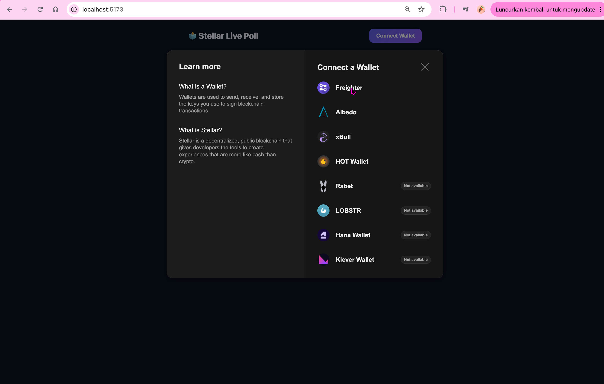

# 🗳️ Stellar Live Poll — Level 2 (Yellow Belt) Submission

Aplikasi poll real-time di atas Stellar/Soroban. Satu pertanyaan, beberapa pilihan, siapa saja
bisa connect wallet dan vote — hasilnya ter-update otomatis dan tersimpan permanen di blockchain.

📖 Panduan instalasi & menjalankan lengkap ada di [`TUTORIAL.md`](./TUTORIAL.md).

## 📸 Screenshot



## ✨ Fitur

- **Multi-wallet** — connect pakai Freighter, xBull, Albedo, Rabet, dll lewat Stellar Wallets Kit
- **Smart contract di testnet** — pertanyaan, pilihan, dan hasil vote disimpan on-chain
- **3 jenis error ditangani**: wallet tidak ditemukan, transaksi ditolak user, saldo tidak cukup — plus error dari contract sendiri (sudah pernah vote, pilihan tidak valid, belum di-inisialisasi)
- **Status transaksi real-time**: menyiapkan → menunggu tanda tangan → mengirim → pending → berhasil/gagal
- **Live results**: hasil vote auto-refresh tiap 5 detik, event `voted` dipublish dari contract

## ✅ Requirement Checklist

| Requirement | Status |
|---|---|
| 3 error types handled | ✅ |
| Contract deployed on testnet | ✅ |
| Contract called from frontend | ✅ |
| Transaction status visible | ✅ |
| Minimum 2+ meaningful commits | ✅ *(lihat riwayat commit)* |
| Multi-wallet integration | ✅ |
| Real-time event/data sync | ✅ |

## 📜 Contract Details

- **Network**: Stellar Testnet
- **Contract ID**: `CADHH3BE547VRTT47AC24SEVJUC3ABQCWVZALF4UCVWA7GQZHONJMVNC`
- **Lihat di explorer**: [stellar.expert/explorer/testnet/contract/CADHH3BE547VRTT47AC24SEVJUC3ABQCWVZALF4UCVWA7GQZHONJMVNC](https://stellar.expert/explorer/testnet/contract/CADHH3BE547VRTT47AC24SEVJUC3ABQCWVZALF4UCVWA7GQZHONJMVNC)


## 🗂️ Struktur Project

```
stellar-poll-dapp/
├── contract/       # Soroban smart contract (Rust)
├── frontend/       # Aplikasi web (React + Vite)
├── TUTORIAL.md     # Panduan instalasi lengkap
└── README.md       # File ini
```

## 🚀 Menjalankan di Komputer Sendiri

Ringkas (detail lengkap ada di `TUTORIAL.md`):

```bash
cd frontend
npm install
cp .env.example .env   # lalu isi VITE_CONTRACT_ID dengan contract ID di atas
npm run dev
```
